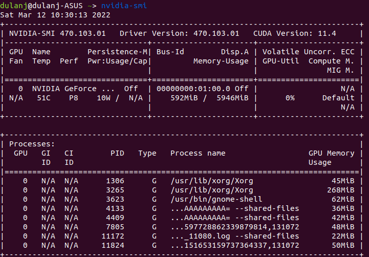
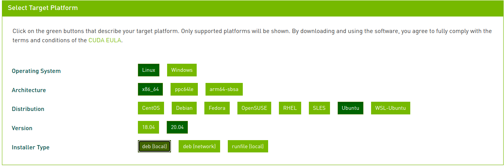
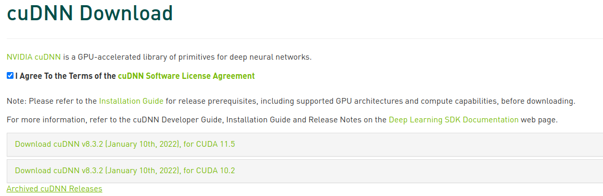
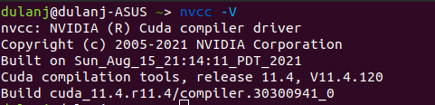

# Install Nvidia Drivers For ML

## Remove exising installations of nvidia and cuda

```angular2html
sudo apt-get remove --purge '^nvidia-.*'
sudo apt-get remove --purge '^libnvidia-.*'
sudo apt-get remove --purge '^cuda-.*'
```

## Install Nvidia-Drivers

Check available drivers:
```angular2html
sudo apt search nvidia-driver
```
This will list down all the available drivers.
Select a driver version and install it.
```angular2html
sudo apt-get install nvidia-driver-470
```
or go to this location and download - https://www.nvidia.com/Download/index.aspx?lang=en-us


Now reboot and then check the driver version:
```angular2html
nvidia-smi
```
This will show all the information with the installed driver.
The upper right corner cuda version is the maximum cuda version supported by the driver.


## Install CUDA

Goto - https://developer.nvidia.com/cuda-toolkit-archive
Download the latest version of cuda toolkit which supported by the driver.
Select the target platform and then it will show the commandline instructions.


example for ubuntu 20.04 cuda 11.4
```angular2html
wget https://developer.download.nvidia.com/compute/cuda/repos/ubuntu2004/x86_64/cuda-ubuntu2004.pin
sudo mv cuda-ubuntu2004.pin /etc/apt/preferences.d/cuda-repository-pin-600
wget https://developer.download.nvidia.com/compute/cuda/11.4.0/local_installers/cuda-repo-ubuntu2004-11-4-local_11.4.0-470.42.01-1_amd64.deb
sudo dpkg -i cuda-repo-ubuntu2004-11-4-local_11.4.0-470.42.01-1_amd64.deb
sudo apt-key add /var/cuda-repo-ubuntu2004-11-4-local/7fa2af80.pub
sudo apt-get update
sudo apt-get -y install cuda
```

## Install cuDNN
 
Go to - https://developer.nvidia.com/cudnn
You need an nvidia developer account to download the cudnn package.

Go to the download page and check the supported cnDNN version for installed cuda version.

If it's not here go to [Archived cuDNN Releases](https://developer.nvidia.com/rdp/cudnn-archive) and download the relevent cuDNN version.

Unzip downloaded tar file

```angular2html
tar -xvf cudnn-linux-x86_64-8.x.x.x_cudaX.Y-archive.tar.xz
```

Copy the following files into the CUDA toolkit directory.
```angular2html
sudo cp cudnn-*-archive/include/cudnn*.h /usr/local/cuda/include 
sudo cp -P cudnn-*-archive/lib/libcudnn* /usr/local/cuda/lib64 
sudo chmod a+r /usr/local/cuda/include/cudnn*.h /usr/local/cuda/lib64/libcudnn*
```
More information - https://docs.nvidia.com/deeplearning/cudnn/install-guide/index.html#installlinux-tar

restart and check the cudnn version
```angular2html
nvcc -V
```


If you see something like this:
```angular2html
Command 'nvcc' not found, but can be installed with:

sudo apt install nvidia-cuda-toolkit
```

Go and install nvidia-cuda-toolkit
```angular2html
sudo apt install nvidia-cuda-toolkit
```
