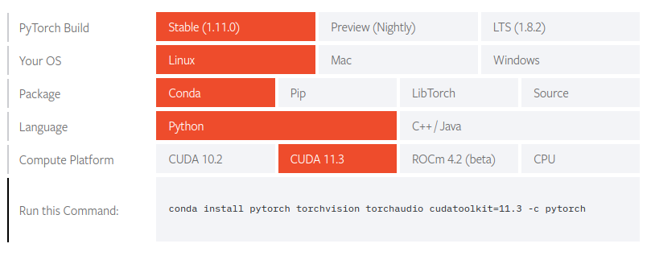
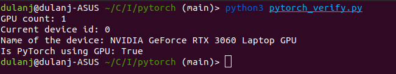

# Pytorch Installation

## Install pytorch to your local machine
Go to [Pytorch's Downloads page](https://pytorch.org/get-started/locally/) and select the platform and build.


The cuda Major version match is enough to get it running on your gpu. \
Copy the command and run it on your local environment.

example :
```bash
conda install pytorch torchvision torchaudio cudatoolkit=11.3 -c pytorch
```

## Verify the installation

Run the script provided in the pytorch folder.

```bash
python3 pytorch_verify.py
```
If successful, you should see the following output:

